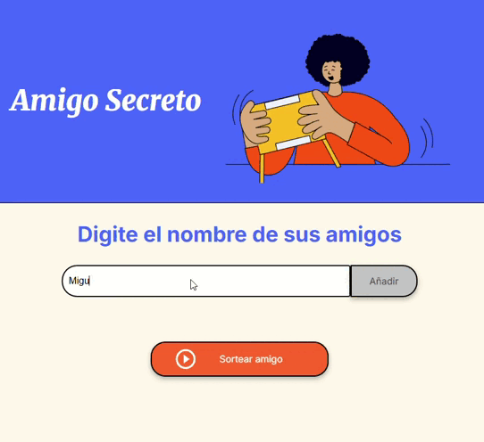

# 🎭 Challenge: Amigo Secreto  

¡Bienvenido al **Challenge Amigo Secreto**! 🎁🎊  

Este proyecto es una divertida aplicación en **JavaScript** que te permite agregar nombres a una lista y luego seleccionar uno al azar como tu "Amigo Secreto". 🎩

## 🚀 Tecnologías utilizadas  

🖥 **HTML** – Estructura básica de la aplicación.  
🎨 **CSS** – Estilos y diseño visual de la interfaz.  
⚙️ **JavaScript** – Lógica para agregar nombres, mostrarlos y realizar el sorteo aleatorio.  

🎯 Funcionalidades  

- ✅ **Agregar nombres** a la lista de participantes.  
- ✅ **Mostrar la lista** de todos los participantes en pantalla.  
- ✅ **Seleccionar un Amigo Secreto** al azar con un solo clic en el botón.  

## 🖼 Vista previa  

Aquí puedes ver cómo funciona la aplicación:  

  

## 📌 Instalación y Uso

1️⃣ **Clona el repositorio:**  
Abre tu terminal y ejecuta el siguiente comando para clonar el repositorio:
  git clone https://github.com/MrMikeRG/challenge-amigo-secreto
2️⃣ **Abre el archivo index.html en tu navegador.** 
Puedes hacer doble clic en el archivo o abrirlo directamente en tu navegador para ver la aplicación en acción.

3️⃣ **Agrega los nombres de tus amigos o participantes en la lista y presiona el botón para que el sistema seleccione un "Amigo Secreto" al azar. 🎲**

## 💡 Mejoras futuras  
- 🔮 Reseteo del juego – Para empezar una nueva ronda.  
- 🙈 Esconder los nombres seleccionados, de manera que solo la persona elegida pueda ver quién es su Amigo Secreto.  
- 🎉 Animaciones – Añadir efectos visuales al momento del sorteo para hacerlo más emocionante.  

